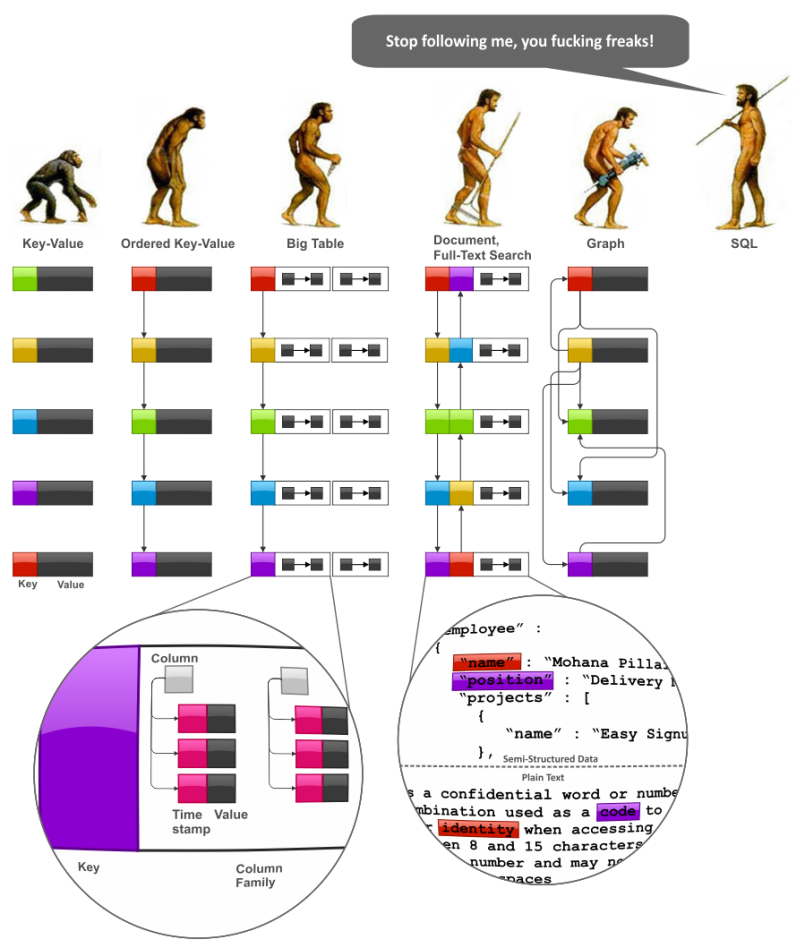

# Data Modeling & NoSQL Databases

## SQL vs NoSQL

- SQL databases are primarily called as Relational Databases (RDBMS);
 whereas NoSQL database are primarily called as non-relational or distributed database.

- SQL databases are table based databases whereas NoSQL databases are document based, key-value pairs, graph databases or wide-column stores.

- SQL databases have predefined schema whereas NoSQL databases have dynamic schema for unstructured data.

- SQL databases uses SQL ( structured query language ) for defining and manipulating the data, which is very powerful. In NoSQL database, queries are focused on collection of documents. Sometimes it is also called as UnQL (Unstructured Query Language). The syntax of using UnQL varies from database to database.

- SQL database examples: MySql, Oracle, Sqlite, Postgres and MS-SQL.
- NoSQL database examples: MongoDB, BigTable, Redis, RavenDb, Cassandra, Hbase, Neo4j and CouchDb

## MongoDB

Mongodb is one of the most popular document based NoSQL database as it stores data in JSON like documents. It is non-relational database with dynamic schema.

- MongoDB is an open source, non- relational database management system. 
- PostgreSQL is a relational database management system

**The following are some of MongoDB benefits and strengths:**

1. Speed: For simple queries, it gives good performance.
2. Scalability: It is horizontally scalable i.e. you can reduce the workload by increasing the number of servers in your resource pool instead of relying on a stand alone resource.
3. Manageable: It is easy to use for both developers and administrators. 
4. Dynamic Schema: Its gives you the flexibility to evolve your data schema without modifying the existing data

##  DATA MODELING 

* Data modeling (data modelling) is the process of creating a data model for the data to be stored in a Database. This data model is a conceptual representation of Data objects, the associations between different data objects and the rules.

* The following figure depicts imaginary “evolution” of the major NoSQL system families, namely, Key-Value stores, BigTable-style databases, Document databases, Full Text Search Engines, and Graph databases:

##  CRUD operations serve

In computer programming, create, read, update, and delete (CRUD) are the four basic functions of persistent storage. Alternate words are sometimes used when defining the four basic functions of CRUD, such as retrieve instead of read, modify instead of update, or destroy instead of delete

