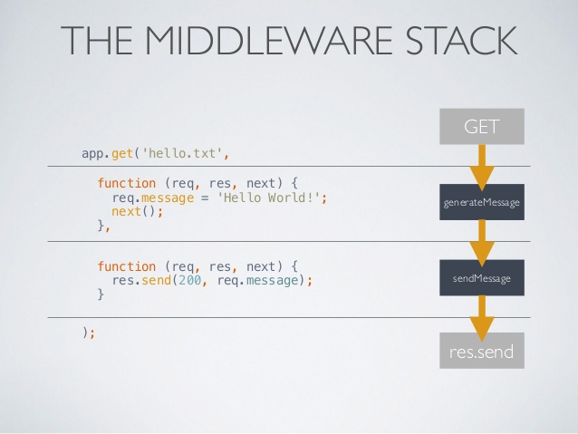
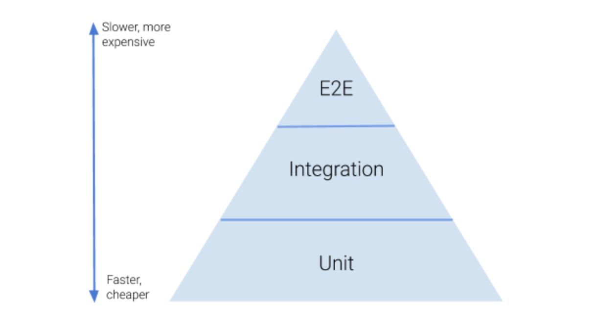

# Express

## Express Routing

- I read about express rout that take req and res in the event driven system 
and the shape of each one of them .
- for example the req obj can be req.params or req.query for the res is take the status and send data.

## Express Middleware

- It is : A series of functions that the request “goes through”
- Each function receives request, response and next as parameters
- Types of middleware: Application and Route

## CRUD Operations with REST and Express

- CRUD : create read update delete

## Server Testing
 
 - use **supertest** to run your tests.
 - **Test Pyramid**

