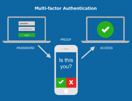

# Authentication

## User Modeling

Modern web applications need to model sensitive information about their users. When a users provides an applications with sensitive information, they are trusting that it will not be leaked are misused. 

## Cryptography

Cryptography is the science which studies methods for encoding messages so that they can be read only by a person who knows the secret information required for decoding, called the key; it includes cryptanalysis, the science of decoding encrypted messages without possessing the proper key .

## Hash Algorithms

- Hash algorithms are often used for checking the integrity of data.
- In a User model, a hash password can be stored when the user signs up. When the user needs to login, they can resend their password and the server can hash the login password using the same hash algorithm. The server can then compare the hashed login password with previously stored hashed password to determine if the user should be authenticated.

## Cypher Algorithms

- A Cryptographic Cypher Algorithm takes a piece of data and a key and produces encrypted data. Later the encrypted data can be reversed into the original data by decrypting it using the same key.

- User tokens can be created by associated a random unique string (tokenSeed) with a user account and, in turn, encrypting the tokenSeed with a secret key that only the server knows. We can then send the encrypted token to a client application. When the client makes a future request they send back the token. The server can reverse the token into the tokenSeed by decrypting it with the secret key. This is because the tokenSeed was unique to the database and can be queried to produce the user who made the request.

## Basic Authorization

Basic Authorization is a common method used to send a username and password in an HTTP request. The username and password are joined with a ‘:’ then “base64 encoded” and placed after the string ‘Basic ‘. The resulting string is set to the value of an Authorization header.

*NOTE: base64 encoding is not a form of encryption. The client and server must use HTTPS to protect the username and password as it travels across the network.*

In browsers, we get `atob` and `btoa` to convert to/from “Base64 Encoding”
