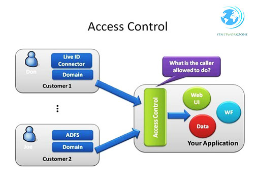

#  Access Control (ACL)

- Limiting what actions a user can preform on a given resource is called `Access Control`.
- A user can be given a token at signup and login, and that user can pass that token back to the server on requests with limited access controls. 
- Once the server parses the token, it can determine if the user is authorized to preform the request.

## Application Flow and Access Control

- Applications of all types have varying degrees of access based on user type and UI requirements.

- A CMS might …

* Allow admin users to create categories, content, manage user accounts, and run reports
* Allow editor users to create, edit and delete existing content, but not see or manage user accounts
* Allow guest users to access (read) content
* Allow user users (logged in users) to access (read) content and apply a thumbs-up/down to content, but not change the actual content

- Each of these constraints will have to be handled on both the backend and the front end of your application stack.

