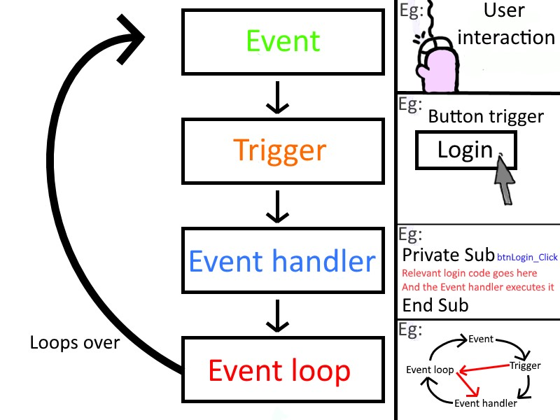

# Event Driven Programming

- **Event-driven programming** is currently the default paradigm in software engineering. As the name suggests, it uses events as the basis for developing the software. These events can be something the users are doing — clicking on a specific button, picking an option from drop-down, typing text into a field, giving voice commands, or uploading a video — or system-generated events such as a program loading.
- It is an approach rather than a type of programming language, it can be practiced with any programming language.

## Emitting Events

- An event emitter is a pattern that listens to a named event, fires a callback, then emits that event with a value. Sometimes this is referred to as a “pub/sub” model, or listener. It's referring to the same thing.

- Node. js has a built-in module, called "Events", where you can create-, fire-, and listen for- your own events. To include the built-in Events module use the require() method. In addition, all event properties and methods are an instance of an EventEmitter object.
 
