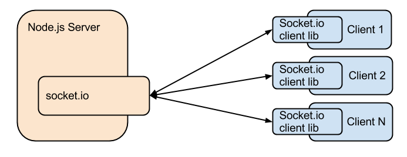

# Socket.io

## Web Sockets

- It is a library which enables real-time and full duplex communication between the Client and the Web servers. 
- It uses the WebSocket protocol to provide the interface.
- Generally, it is divided into two parts, each of which use WebSockets, but also provide additional functionality such as broadcasting, namespacing, and other means of segmenting connected clients into groups.

`Client Side`: it is the library that runs inside the browser
`Server Side`: It is the library for Node.js

## Connections

- With `TCP`, you connect directly to a server with a keep-alive type of connection.
- With `Socket.io`, you connect to a server over HTTP. 
- The session is “kept alive” through it’s internal use of the WebSocket Protocol, with session information being preserved.

## Messaging

- Standard node events are sent with emit() and received with on() … Socket.io uses the same methodology/terminology.
- With Socket.io, the entire purpose is to have events shared between ‘disconnected’ participants. Through a mediator (server), clients connect, emit events, and respond to events from the server.

