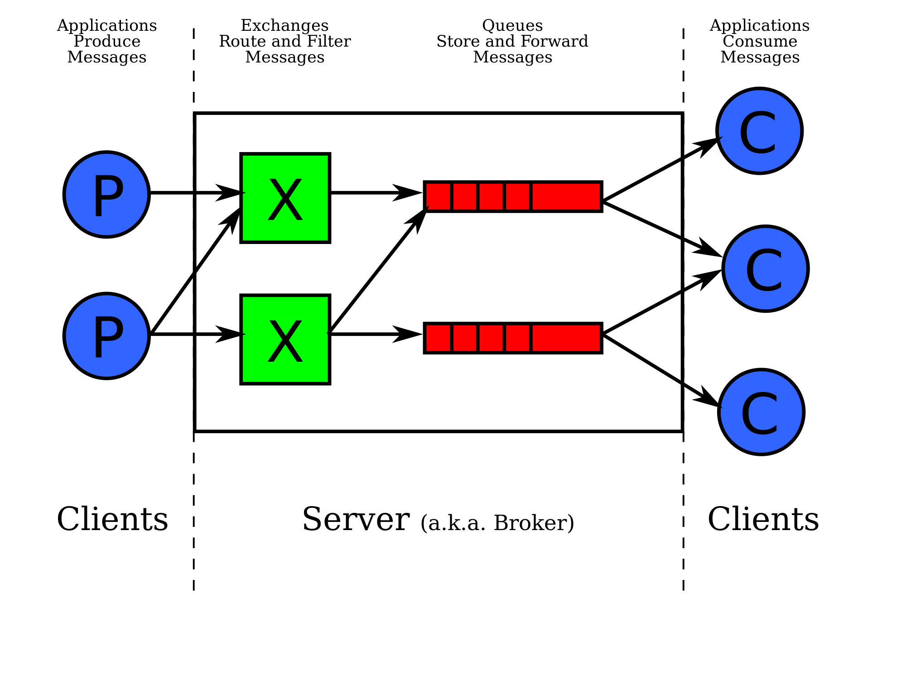

# Message Queues

A Queue server runs independently, and is tasked with routing events and messaging between clients.

- Any connected client can `“publish”` a message into the server.
- Any connected client can `“subscribe”` to receive messages by type.

The Queue server has the ability to see which clients are connected, to which Queues they are attached and further, to which events they are subscribed.

## What is a message?
A message is a package of information, categorized by queue and event

## Real Time vs Queued Messaging

**“Real Time” messaging systems**
In some cases, messages are simply brokered by the server. 
They come in, are processed and are immediately broadcast out to subscribers.
Should a subscriber at any point lose connection with the server, any messages broadcast by the server will clearly be missed by the client.

**Queued Messaging**
A true `“Queue”` will keep track of the delivery status of every event/message. 
Any broadcast that is not received by a subscriber will remain “in the queue” until it can be delivered. 
In this type of systems, rather than a broadcasting of messages, clients will likely “poll” the server to retrieve any messages “in the queue” for them, on their own timeline/schedule.

