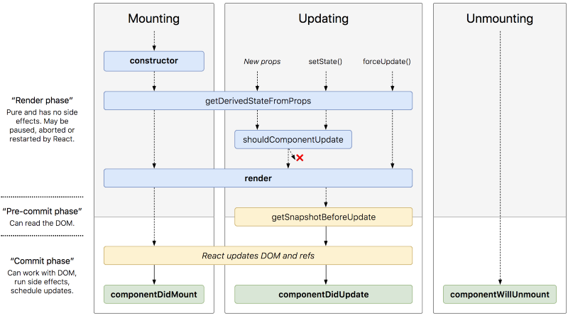

# Component Composition

## Routing

- `React Router` does is conditionally render certain components to display depending on the route being used in the URL (/ for the home page, /about for the about page, etc...).
- To use React Router, you first have to install it using NPM:
```
npm install react-router-dom
```
- Also we need to `import { Route } from 'react-router-dom';`

- To tell the <Route> tags which component to load, simply add a path attribute and the name of the component you want to load with component attribute.
 ```
 <Route path='/' component={Home} />
```
## React’s props.children

- `this.props.children` does is that it is used to display whatever you include between the opening and closing tags when invoking a component.

- ex:

 ```
const Picture = (props) => {
  return (
    <div>
      
      {props.children}
    </div>
  )
}
 ```
* This component contains an  that is receiving some props and then it is displaying {props.children}.
* Whenever this component is invoked {props.children} will also be displayed and this is just a reference to what is between the opening and closing tags of the component.

## The Component Lifecycle



- The columns represent different stages in the components life.

- A component can only be in one stage at a time. It starts with mounting and moves onto updating. It stays updating perpetually until it gets removed from the virtual DOM. Then it goes into the unmounting phase and gets removed from the DOM.

- The lifecycle methods allow us to run code at specific points in the component’s life or in response to changes in the component’s life.
