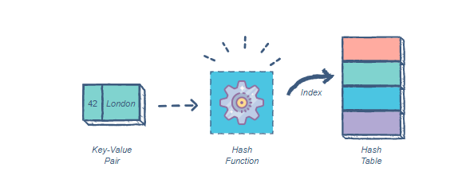
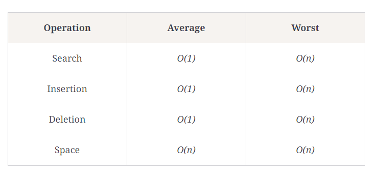

# Hashtables

## What is a Hashtable?

- A `hash table` is a type of data structure that stores key-value pairs.
- The `key` is sent to a hash function that performs arithmetic operations on it. 
- The `result` (commonly called the `hash value` or `hash`) is the index of the key-value pair in the hash table.

## Components of a hash table

1. Hash function
  - it’s a one-way function,the key cannot be retrieved from the hash.
  - it avoids producing the same hash for different keys.
2. Array
  - holds all the key-value entries in the table

## Collisions in hash tables & resolutions

- A collision occurs when two keys get mapped to the same index. 
- There are several ways of handling collisions.

 1. Linear probing

 - If a pair is hashed to a slot which is already occupied, it searches linearly for the next free slot in the table.

 2. Chaining

 - The hash table will be an array of linked lists. 
 - All keys mapping to the same index will be stored as linked list nodes at that index.
 
 3. Resizing the hash table

 - The size of the hash table can be increased in order to spread the hash entries further apart.

 ## Complexities

## Internal Methods

1. Add()
When adding a new key/value pair to a hashtable:

send the key to the GetHash method.
Once you determine the index of where it should be placed, go to that index
Check if something exists at that index already, if it doesn’t, add it with the key/value pair.
If something does exist, add the new key/value pair to the data structure within that bucket.
2. Find()
The Find takes in a key, gets the Hash, and goes to the index location specified. Once at the index location is found in the array, it is then the responsibility of the algorithm the iterate through the bucket and see if the key exists and return the value.

3. Contains()
The Contains method will accept a key, and return a bool on if that key exists inside the hashtable. The best way to do this is to have the contains call the GetHash and check the hashtable if the key exists in the table given the index returned.

4. GetHash()
The GetHash will accept a key as a string, conduct the hash, and then return the index of the array where the key/value should be placed.

