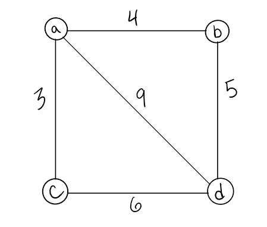

# Implementation: Graphs

- `Graph` is a non-linear data structure that can be looked at as a collection of `vertices` (or `nodes`) potentially connected by line segments named edges.

## Graphs terminology :

* Vertex - A vertex, also called a “node”, is a data object that can have zero or more adjacent vertices.
* Edge - An edge is a connection between two nodes.
* Neighbor - The neighbors of a node are its adjacent nodes, i.e., are connected via an edge.
* Degree - The degree of a vertex is the number of edges connected to that vertex.

## Directed vs Undirected
### Undirected Graphs
An Undirected Graph is a graph where each edge is undirected or bi-directional. This means that the undirected graph does not move in any direction.

### Directed Graphs (Digraph)
A Directed Graph also called a Digraph is a graph where every edge is directed.

`Unlike an undirected graph, a Digraph has direction. Each node is directed at another node with a specific requirement of what node should be referenced next.`

## Complete vs Connected vs Disconnected
- **Complete Graphs**
A complete graph is when all nodes are connected to all other nodes.

- **Connected**
A connected graph is graph that has all of vertices/nodes have at least one edge.

- **Disconnected**
A disconnected graph is a graph where some vertices may not have edges.

`a sparse graph is when there are very few connections. a dense graph is when there are many connection`

## Acyclic vs Cyclic

**Acyclic Graph**
An acyclic graph is a directed graph without cycles.
A cycle is when a node can be traversed through and potentially end up back at itself.

**Cyclic Graphs**
A Cyclic graph is a graph that has cycles.
A cycle is defined as a path of a positive length that starts and ends at the same vertex.

## Weighted Graphs
- A weighted graph is a graph with numbers assigned to its edges. These numbers are called weights.
- When representing a weighted graph in a matrix, you set the element in the 2D array to represent the actual weight between the two paths.
- If there is not a connection between the two vertices, you can put a 0, although it is known for some people to put the infinity sign instead.

*Here are just a few examples of graphs in use:*

1. GPS and Mapping
2. Driving Directions
3. Social Networks
4. Airline Traffic
5. Netflix uses graphs for suggestions of products

